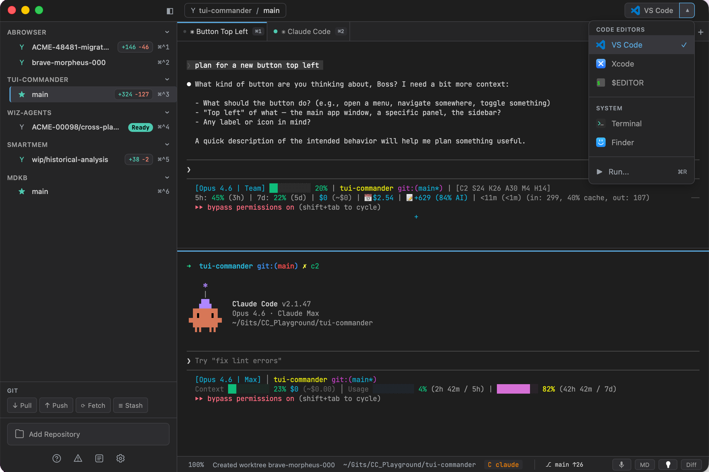

<p align="center">
  
</p>

<h1 align="center">TUI Commander</h1>

<p align="center">
  <strong>The desktop companion for AI coding agents.<br>Run Claude Code, Gemini CLI, Aider, and more — all in one window, no IDE required.</strong>
</p>

<p align="center">
  <a href="https://github.com/sstraus/tui-commander/releases"></a>
  <a href="https://github.com/sstraus/tui-commander/actions/workflows/release.yml"></a>
  <a href="LICENSE"></a>
  
  
  
  
</p>

---

<p align="center">
  
</p>

---

## Your Terminal Agents Deserve a Real Home

If you use **Claude Code**, **Gemini CLI**, **Aider**, or any terminal-based AI agent, you know the drill: a dozen terminal windows, no idea which agent is stuck on a rate limit, context-switching between repos, and VS Code eating RAM in the background just for a file tree.

**TUI Commander replaces all of that.** It's a lightweight, native desktop app built specifically for running AI coding agents in parallel — with the control and visibility you need, and none of the overhead you don't.

Need VS Code? Launch it with one click from any repo. But you'll find you need it less and less.

## What Makes It Different

**Built for agents, not adapted from a text editor.** Every feature exists because multi-agent workflows demand it:

- **50+ terminals in one window** — tabbed, split, zoomable, each with its own font size
- **Agent-aware** — detects which agent is running, tracks rate limits, shows usage percentages, alerts you when an agent needs input
- **Git worktree isolation** — spin up an isolated branch per task without stashing, each agent works in its own workspace
- **Rate limit resilience** — configurable fallback chains: when Claude hits a limit, automatically switch to Gemini or Aider
- **Voice dictation** — talk to your agents via on-device Whisper inference, no cloud API
- **Session persistence** — close the app, reopen it, everything is exactly where you left it
- **MCP server** — expose your terminals and repos to external AI tools via the Model Context Protocol

## Feature Highlights

### Terminal Management
- `Cmd+T` / `Cmd+W` to open and close, `Cmd+1-9` to switch, `Cmd+Shift+T` to reopen
- Per-pane font zoom (`Cmd+Plus/Minus/0`) — read one terminal at 20px while others stay at 14px
- Vertical and horizontal split panes for side-by-side work
- WebGL-accelerated rendering via xterm.js
- Tab context menu with rename, split, reset, and close

### Multi-Agent Orchestration
- **5 agents supported:** Claude Code, Gemini CLI, OpenCode, Aider, Codex
- Automatic agent detection from terminal output patterns
- **Usage limit tracking** — color-coded percentage badges (blue < 70%, yellow 70-89%, red pulsing >= 90%)
- Question/prompt detection with sidebar indicators and dock badge (macOS)
- **Prevent system sleep** while agents are working

### Git & GitHub
- Repository sidebar with branch status and CI indicators
- Git worktree management — one click to create an isolated workspace
- GitHub GraphQL API for PR statuses, CI checks, review decisions — no `gh` CLI dependency
- Built-in diff viewer and markdown viewer
- Git operations panel (`Cmd+Shift+G`), branch switcher (`Cmd+Ctrl+1-9`)
- PR detail popover with merge state and status checks

### Prompt Library
- Save, search, and reuse prompts (`Cmd+K`) with `{variable}` substitution
- Categories, favorites, and keyboard-driven navigation

### Voice Dictation
- On-device speech-to-text via Whisper with Metal GPU acceleration (macOS)
- Push-to-talk with configurable global hotkey
- Auto-downloads models from HuggingFace

### IDE Integration
- Launch VS Code, Cursor, Zed, or Neovim from any repo with one click
- lazygit integration (`Cmd+G`) with split-pane mode

### Smart & Extensible
- **MCP server bridge** — external AI tools can control terminals and query repo data via HTTP
- **Auto-update** with download progress and one-click install
- Audio notifications with per-event control (question, error, completion, warning)
- 13 bundled monospace fonts, centralized settings (`Cmd+,`)
- Ideas panel (`Cmd+N`) for capturing thoughts alongside your work

> TUI Commander is in active development. New features land regularly — check the [releases](https://github.com/sstraus/tui-commander/releases) to see what's new.

## Keyboard Shortcuts

| Shortcut | Action |
|----------|--------|
| `Cmd+T` | New terminal |
| `Cmd+W` | Close terminal |
| `Cmd+Shift+T` | Reopen closed tab |
| `Cmd+1-9` | Switch to tab N |
| `Cmd+Shift+[/]` | Previous / next tab |
| `Cmd+[` | Toggle sidebar |
| `Cmd++/-/0` | Zoom in / out / reset |
| `Cmd+L` | Clear terminal |
| `Cmd+K` | Prompt library |
| `Cmd+R` | Run saved command |
| `Cmd+D` | Toggle diff panel |
| `Cmd+M` | Toggle markdown panel |
| `Cmd+N` | Toggle Ideas panel |
| `Cmd+G` | Open lazygit |
| `Cmd+Shift+G` | Git operations panel |
| `Cmd+J` | Task queue |
| `Cmd+,` | Settings |
| `Cmd+?` | Help panel |
| `Cmd+Ctrl+1-9` | Quick branch switch |

> On Windows and Linux, substitute `Ctrl` for `Cmd`.

## Supported Agents

| Agent | Binary | What TUI Commander Tracks |
|-------|--------|---------------------------|
| Claude Code | `claude` | API rate limits, overloaded errors, weekly/session usage % |
| Gemini CLI | `gemini` | 429 errors, quota exceeded, RESOURCE_EXHAUSTED |
| OpenCode | `opencode` | Rate limit patterns |
| Aider | `aider` | Rate limit patterns |
| Codex | `codex` | Rate limit patterns |

## Getting Started

### Download

Grab the latest build from [Releases](https://github.com/sstraus/tui-commander/releases). macOS builds are signed and notarized.

### Build from Source

```bash
# Prerequisites: Node.js, Rust toolchain, Tauri CLI
npm install
npm run tauri dev      # Development with hot reload
npm run tauri build    # Production build
npm test               # Run test suite (1400+ tests)
```

### Build & Sign (macOS)

```bash
make build             # Build .app bundle
make sign              # Sign with Developer ID (auto-detected)
make release           # Build + sign + notarize + zip
```

## Tech Stack

| Layer | Technology | Why |
|-------|-----------|-----|
| **UI** | SolidJS | Fine-grained reactivity, no virtual DOM overhead |
| **Terminal** | xterm.js + WebGL | Canvas-rendered terminal with addon ecosystem |
| **Backend** | Rust + Tauri v2 | Native PTY management, async I/O with tokio |
| **Build** | Vite + LightningCSS | Fast HMR in dev, optimized production builds |

See [docs/](docs/) for architecture documentation.

## License

[MIT](LICENSE)
