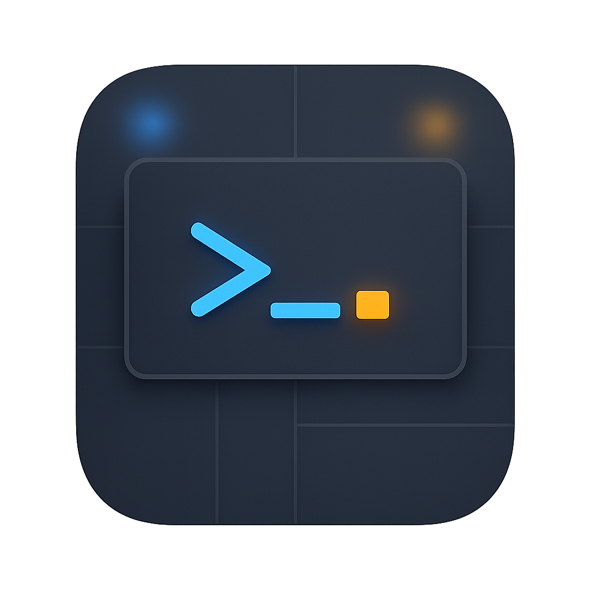
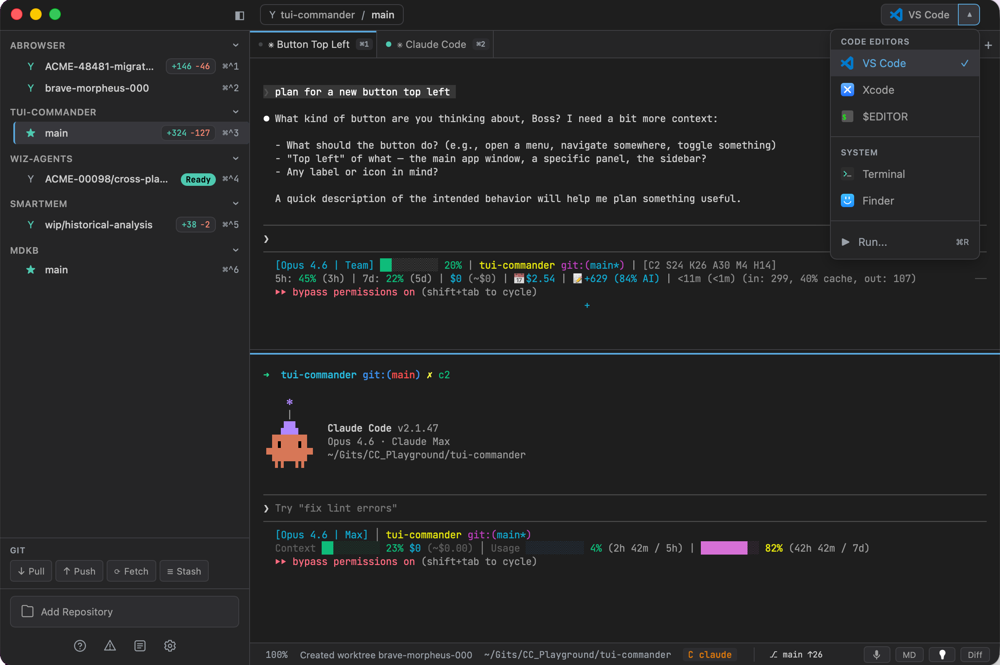

<p align="center">
  
</p>

<h1 align="center">TUICommander</h1>

<p align="center">
  <strong>A modern terminal and AI-native IDE.<br>Work with multiple agents in one place, without losing context.</strong>
</p>

<p align="center">
  <a href="https://github.com/sstraus/tuicommander/releases/latest"></a>
  <a href="https://github.com/sstraus/tuicommander/releases/tag/tip"></a>
  <a href="https://github.com/sstraus/tuicommander/actions/workflows/ci.yml"></a>
  <a href="LICENSE"></a>
  
  
  
</p>

<p align="center">
  <a href="https://github.com/sstraus/tuicommander/releases/latest"><strong>Download</strong></a> &bull;
  <a href="https://github.com/sstraus/tuicommander/releases/tag/tip"><strong>Nightly</strong></a> &bull;
  <a href="docs/FEATURES.md"><strong>All Features</strong></a> &bull;
  <a href="docs/plugins.md"><strong>Plugin API</strong></a> &bull;
  <a href="docs/"><strong>Docs</strong></a>
</p>

---

<p align="center">
  
</p>

---

## The problem

You're running Claude Code on five branches. One hit a rate limit 12 minutes ago. Another is waiting for a Y/N answer. A third finished and you didn't notice. You find out by accident — when you happen to glance at the right terminal.

Then you switch to VS Code to check a diff, open GitHub to see if CI passed, pull out your laptop to check from the couch. Every tool switch is lost context.

The more sessions you run, the worse it gets. The tooling doesn't understand what's happening inside the terminal.

## The solution

**TUICommander is a modern terminal and AI-native IDE** — designed from the ground up for multi-agent development. Agents, code, diffs, PRs, CI status, and usage analytics live in one window. No context switching. No lost threads.

AI-native means the agents are not an afterthought. Rate limit detection, question recognition, session-aware resume, and usage tracking are core — not plugins.

---

## What makes it different

### Agent awareness — not just terminals

TUICommander auto-detects **10 AI coding agents** (Claude Code, Codex CLI, Aider, Gemini CLI, Amp, Cursor Agent, OpenCode, Warp Oz, Droid, Jules) and understands what they're doing:

- **Rate limit detection** — Provider-specific patterns with countdown timers per session.
- **Question detection** — Y/N prompts, numbered options, inquirer-style menus. Tab indicator, notification sound, keyboard overlay.
- **Usage tracking** — Claude Code weekly/session limits with color-coded thresholds. Full Claude Usage Dashboard with rate limit bars, 7-day chart, 52-week heatmap, per-project breakdown.
- **Activity dashboard** — Every session at a glance: agent type, status (working / waiting / rate-limited / idle), last activity.
- **Session-aware resume** — Auto-discovers agent session IDs from disk (Claude Code, Gemini CLI, Codex CLI). Resume exactly where you left off.

No other tool knows that your agent is stuck.

### One branch, one worktree, one world

Click a branch in the sidebar. TUICommander auto-creates a git worktree — a fully isolated copy of the repo. The terminal opens *inside* it. Switch to another branch: your previous terminals are preserved. Switch back: they're exactly as you left them.

```
Add repo → Click branch → Worktree auto-created → Terminal opens in isolated copy
                                                   ├── Claude Code on feature-auth
                                                   ├── Switch branch → Claude Code on fix-payments
                                                   ├── Switch branch → Codex on refactor-api
                                                   └── Activity dashboard shows all sessions
```

Every agent works on its own copy. No stashing, no conflicts, no "wrong branch" mistakes.

### See what your agents changed — without leaving

The feedback loop happens in the same window:

- **Git Panel** — Staging, inline commit, blame with age heatmap, canvas commit graph, stashes, branches with ahead/behind counts.
- **Diff views** — Side-by-side, unified, or scroll-all-files. Word-level highlighting, hunk and line-level restore.
- **PR management** — Merge via GitHub API with auto-detected merge method. Post-merge cleanup: switch base, pull, delete branch, archive worktree — all in one dialog.
- **CI Auto-Heal** — When CI fails, TUICommander fetches failure logs and injects them into the agent for automatic fix.
- **Built-in code editor** — CodeMirror 6 with syntax highlighting, find/replace, disk conflict detection.
- **File browser** — Directory tree, content search (grep), git status indicators.

### One connection for all your tools

The **MCP Proxy Hub** aggregates all your MCP servers into a single endpoint. Claude Code, Cursor, VS Code — each agent connects once and gets access to every upstream tool.

- Circuit breakers, health checks, hot-reload per upstream
- Credential management via OS keyring
- Tool filtering: whitelist or blacklist per upstream server
- Add or remove servers without restarting anything

For teams, this means one MCP connection instead of N. The agents get everything.

### Control from anywhere

A **mobile companion PWA** lets you monitor agents from your phone, answer questions with one tap, and track rate limits in real time.

- QR code scan for instant LAN connection
- Tailscale auto-HTTPS or E2E-encrypted cloud relay — no VPN or port forwarding
- Live WebSocket output, suggest follow-up chips, slash menu
- Works offline — queues commands until reconnected

### Agents that coordinate

**Agent Teams** — Claude Code's sub-agents run as native TUICommander tabs instead of tmux panes. Full session awareness, output parsing, and question detection for each sub-agent.

**Inter-agent messaging** — When multiple agents work in parallel, they discover peers, send messages, and receive push notifications through TUICommander as the coordination hub. No external daemon needed.

### Talk to your agents

On-device speech-to-text powered by whisper-rs. No cloud service, no API keys, no data leaving your machine.

- GPU-accelerated on macOS (Metal), CPU fallback on Windows/Linux
- Streaming transcription with partial results in ~1.5s
- Push-to-talk hotkey — text injected into the active terminal

### Automate repetitive workflows

**Smart Prompts** — 24 built-in one-click operations: Smart Commit, Review Changes, Create PR, Fix CI, and more. Context variables like branch, diff, and PR data are resolved automatically.

- Inject mode (PTY write), headless mode (subprocess), or API mode (direct LLM call)
- Create your own prompts with the same variable system
- Placement options: toolbar, Git Panel, PR popover, command palette

### Extend everything

**Plugin system** — Obsidian-style plugins with hot reload and a community registry:

- 15 capability tiers from read-only watchers to PTY write access
- Terminal output watchers with regex triggers
- Status bar tickers, custom panels, notification contributions
- Browse and install with one click

[Plugin Authoring Guide →](docs/plugins.md)

---

## How it compares

| Capability | tmux | Warp | Cursor | TUICommander |
|---|---|---|---|---|
| Terminal sessions | Yes | Yes | Yes | Yes (50, split, detach) |
| AI coding agents | No | Partial | Built-in | Any agent (10 detected) |
| Parallel agents | No | No | Limited | Unlimited |
| Git worktree orchestration | No | No | No | Automatic |
| Agent observability | No | No | No | Real-time |
| MCP Proxy Hub | No | No | No | Built-in |
| Remote access (phone) | SSH | No | No | Built-in PWA |
| Voice dictation | No | No | Extension | Local Whisper |
| CI Auto-Heal | No | No | No | Built-in |
| Plugin system | No | No | Extensions | Hot reload |

---

<details>
<summary><strong>Terminal features</strong> — 50 sessions, splits, detach, find, persistence</summary>

- Up to 50 concurrent PTY sessions, each with independent zoom (8–32px)
- Split panes: vertical (`Cmd+\`) or horizontal (`Cmd+Alt+\`), up to 6 panes, drag-resize
- Detachable tabs: float any terminal into its own OS window, re-attaches on close
- Find in terminal (`Cmd+F`): regex, case-sensitive, whole word, match navigation
- Cross-terminal search: type `~` in command palette to search all open terminal buffers
- Session persistence: terminals survive restarts with lazy restore on branch click
- Tab management: reorder by drag, rename by double-click, reopen last 10 closed tabs
- Tab status dots: idle, busy, done, unseen, question, error
- Copy on select, configurable bell (visual/sound/both), scroll shortcuts
- International keyboard support, Kitty keyboard protocol
</details>

<details>
<summary><strong>Git integration</strong> — Worktrees, Git Panel, PR management</summary>

- Auto-create worktrees per branch with configurable base branch and setup scripts
- Worktree Manager (`Cmd+Shift+W`): all worktrees across all repos, orphan detection, batch operations
- Git Panel (`Cmd+Shift+D`): staging, commit, log with canvas commit graph, stashes, branches, blame with age heatmap
- PR management: merge via GitHub API, auto-detect merge method, post-merge cleanup dialog
- Auto-delete branch on PR close, CI Auto-Heal, PR notifications
- Repository groups: named, colored, collapsible, drag-and-drop reordering
- Park repos: temporarily hide repos you're not using
- Quick branch switcher: hold `Cmd+Ctrl`, press `1-9` to switch instantly
- Auto-fetch on configurable interval
</details>

<details>
<summary><strong>Productivity</strong> — Smart Prompts, palette, keybindings, dictation</summary>

- Smart Prompts (`Cmd+Shift+K`): 24 built-in AI automation prompts with auto-resolved context variables
- Command palette (`Cmd+P`): fuzzy search all actions, files (`!`), file contents (`?`), terminal buffers (`~`)
- Configurable keybindings with chord support and conflict detection
- Claude Usage Dashboard: rate limits, 7-day chart, 52-week heatmap, per-project breakdown
- Prompt library (`Cmd+K`): saved prompts with variable substitution
- IDE launchers: open in VS Code, Cursor, Zed, or any detected editor
- Ideas panel (`Cmd+N`): quick notes with image paste and send-to-terminal
- Voice dictation: streaming on-device Whisper with partial results
- 13 bundled monospace fonts
</details>

> **Full feature reference:** **[docs/FEATURES.md](docs/FEATURES.md)**

---

## Get started

**[Download the latest release](https://github.com/sstraus/tuicommander/releases/latest)** — macOS builds are signed and notarized.

Want the bleeding edge? The **[Nightly](https://github.com/sstraus/tuicommander/releases/tag/tip)** is rebuilt on every push to `main`.

<details>
<summary>Build from source</summary>

**Prerequisites:** Node.js 22+, Rust toolchain, [Tauri CLI](https://tauri.app/start/)

```bash
npm install
npm run tauri dev      # Development with hot reload
npm run tauri build    # Production build
npm test               # Run tests
```

See [docs/guides/development-setup.md](docs/guides/development-setup.md) for platform-specific instructions.
</details>

## Built with

Rust + [Tauri v2](https://tauri.app) backend, [SolidJS](https://solidjs.com) UI, [xterm.js](https://xtermjs.org) + WebGL terminals, [CodeMirror 6](https://codemirror.net) editor, [whisper-rs](https://github.com/tazz4843/whisper-rs) dictation, [Vite](https://vite.dev) + LightningCSS build. ~80 MB RAM.

## Documentation

| | |
|---|---|
| [Getting Started](docs/user-guide/getting-started.md) | First-run guide |
| [Features](docs/FEATURES.md) | Complete feature reference with all keyboard shortcuts |
| [AI Agents](docs/user-guide/ai-agents.md) | Agent detection, rate limits, question detection |
| [Plugin API](docs/plugins.md) | Build plugins for TUICommander |
| [HTTP API](docs/api/http-api.md) | REST/WebSocket/SSE endpoints |
| [Architecture](docs/ARCHITECTURE.md) | System design and component overview |
| [Development Setup](docs/guides/development-setup.md) | Build from source |

---

<p align="center">MIT licensed. Zero telemetry. Runs locally.<br><a href="https://github.com/sstraus/tuicommander/releases">Follow the releases</a> — new features land weekly.</p>

## License

[MIT](LICENSE) &copy; 2026 Stefano Straus
